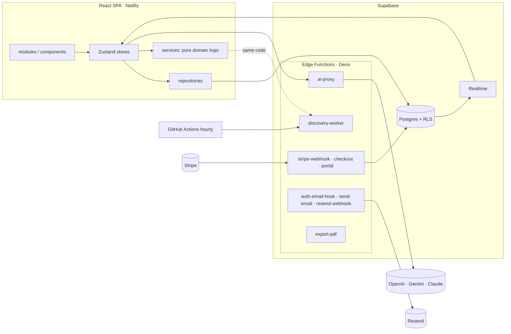

# Octant

[](https://github.com/DeyvidJesus/octant/actions/workflows/ci.yml)

**A career operating system for software engineers.** You describe your career once, in a structured
knowledge base, and Octant derives everything else from it: how well you match each job, a résumé
tailored to that job, interview preparation for it, the application pipeline, and the metrics of your
search. An agent keeps looking for new openings while you're offline.

The design principle behind all of it: **deterministic code owns the truth, the LLM only owns the
language.** Scores, matches and résumé content are computed from your real data; AI explains, drafts
questions or grades answers, and its output is checked by code before you see it.

---

## What it does

| Area | What you get |
|---|---|
| **Knowledge base** | Profile, experience, projects, skills, credentials, stories and metrics as typed entities. Import from a pasted résumé with AI; everything imported starts as *needs review*. |
| **Job analysis** | Paste a job description → required vs. nice-to-have skills, seniority, an ATS-style match score, gaps and strengths. A "Recruiter Read" (AI) gives an honest verdict, with unverified claims flagged. |
| **Résumé generator** | Selects and ranks your real bullets and projects for one job. Toggle any line and a coverage meter shows its keyword cost instantly. Server-rendered, ATS-safe PDF; Markdown/plain-text export. |
| **Discovery agent** | Searches for current openings (grounded web search), de-duplicates, scores them against your résumé, and queues them for your approval. Runs in the open app and on a schedule. Learns from what you approve or dismiss. |
| **Application tracker** | Kanban board (drag and drop, or keyboard) and a sortable table, with follow-ups, contacts and an activity timeline per application. |
| **Interview prep** | Technical, behavioral (STAR) and system-design questions from the job's stack and your gaps. An AI coach grades your answers; mastery per skill accumulates over time. |
| **Metrics** | Funnel and conversion, response/offer/ghost rates, time in stage, weekly activity, match-score distribution. |
| **Plans** | Free and Pro via Stripe Checkout and Customer Portal. Limits are enforced by the database, not just the UI. |

## How it stays honest

- **Matching is a set intersection.** A skill counts as matched only if it is in both the job and your
  résumé, so no analyzer can invent experience. ATS score = matched weight / total weight, with
  required skills weighted ×2 ([src/services/analysis](src/services/analysis)).
- **The anti-hallucination guardrail is code, not a prompt.** Generated text is scanned with the same
  skill extractor used for analysis; any skill it names that isn't in your résumé or the job is flagged
  (or, for agent-written explanations, the text is dropped) ([grounding.ts](src/services/ai/guardrails/grounding.ts)).
- **The generator cannot write a word.** It only selects and orders existing content, and every bullet
  keeps the id of the fact it came from ([src/services/generator](src/services/generator)).
- **AI transcribes, code decides.** Résumé import, job extraction and question generation ask the model
  for JSON only, then validate and normalize it deterministically, with one corrective retry.

---

## Architecture



**Layers** (enforced by lint rules in [.oxlintrc.json](.oxlintrc.json)):
`modules/components → stores → repositories/services → types/utils/constants`. UI never touches
Supabase or a repository directly; `services/` and `repositories/` never import React or stores. The
pure core in `services/` runs both in the browser and in the Deno `discovery-worker`.

Full write-up: [docs/architecture.md](docs/architecture.md).

### Engineering highlights

**Frontend**
- **Optimistic, store-driven UI.** Mutations apply synchronously; `persist()` writes in the background,
  and on failure shows a toast and reconciles with the server (e.g. a row rejected by a plan cap disappears).
- **Realtime sync across devices**, merged idempotently by id (which also absorbs a device's own echo).
  Hydration is keyed on the user id, and every store resets on sign-out or user switch.
- **Design system on Tailwind v4 tokens**: surfaces, ink, inversion and status intents
  (`success/danger/warning/info`). Primitives merge classes with `cn()` (tailwind-merge), and a test
  fails the build if a raw palette class appears in UI code.
- **Code-split routes** for the heavy pages (analysis, generator, prep, knowledge base, metrics).
- **Accessibility**: keyboard moves between Kanban columns, `role="meter"` scores, labelled icon buttons,
  promise-based confirm dialog, `aria-live` toasts.

**Backend**
- **RLS on every table**; free-plan caps live in RLS `WITH CHECK` policies (with upserts of existing rows exempted).
- **`ai-proxy`**: vendor keys server-side, fixed endpoint allowlist (no SSRF), output-size clamp,
  monthly token budget per plan.
- **Stripe webhook**: signature-verified; the subscription upsert is the contract (DB error → 500 so
  Stripe retries), billing emails are best-effort and never cause a redelivery.
- **Idempotent email**: a unique `email_log.idempotency_key` claim row plus the same key sent to Resend;
  out-of-order delivery webhooks cannot move a status backwards.
- **One source, two runtimes**: an esbuild step bundles the shared TypeScript core for the Deno edge
  runtime ([scripts/bundle-functions.mjs](scripts/bundle-functions.mjs)); CI fails if a bundle is stale.

---

## Tech stack

| | |
|---|---|
| **App** | React 19, TypeScript (strict), Vite, React Router 7, Zustand, Tailwind CSS v4, Recharts, lucide-react |
| **Backend** | Supabase: Postgres, Auth, Row Level Security, Realtime, Edge Functions (Deno) |
| **AI** | Provider-agnostic adapters (OpenAI, Gemini with Google Search grounding, Claude, OpenRouter, local OpenAI-compatible) behind one `LLMProvider` interface |
| **Services** | Stripe (billing), Resend + React Email (14 transactional templates), PostHog, Sentry |
| **Quality** | Vitest + Testing Library (happy-dom), oxlint, GitHub Actions |

## Project structure

```
src/
├── app/           # Router (lazy routes), layout shell
├── contexts/      # Auth: session → hydration → realtime
├── modules/       # One folder per feature (pages + feature components)
├── components/    # Domain-agnostic UI primitives and layout
├── stores/        # Zustand stores, persist(), cross-store orchestration
├── repositories/  # The only code that queries Supabase tables
├── services/      # Pure domain logic: analysis, generator, discovery, interview prep, metrics, AI
├── constants/ types/ utils/
└── styles/        # Design tokens
packages/email/    # Server-only email module (templates, renderer, Resend transport, retry)
supabase/
├── functions/     # Edge Functions
└── migrations/    # Schema history (0001 → 0016)
```

## Getting started

Requirements: Node 22+, Yarn 1, a Supabase project.

```bash
yarn install
cp .env.example .env   # set VITE_SUPABASE_URL and VITE_SUPABASE_ANON_KEY
yarn dev
```

Database: run `supabase-schema.sql`, then the migrations it lists, in the Supabase SQL editor. Edge
Functions, secrets and the discovery scheduler are covered step by step in
[docs/PRODUCTION.md](docs/PRODUCTION.md).

| Script | What it does |
|---|---|
| `yarn dev` | Vite dev server |
| `yarn test` | Vitest (≈470 tests) |
| `yarn lint` | oxlint, including layer-boundary rules |
| `yarn build` | Type-check + production build |
| `yarn build:functions` | Regenerate the bundled Edge Functions (run after editing a `worker.ts`/`handler.ts`) |
| `yarn email:dev` | Preview email templates |

## Testing

Most of the value is in pure functions, so most tests are fast unit tests: the skill extractor and
matcher, résumé generation and coverage, metrics, discovery (dedupe, strategies, learning, cadence),
AI response parsers, the grounding guardrail and email mapping/rendering. Component tests (happy-dom)
cover auth flows, the confirm dialog and toasts. CI runs lint, tests, the build and the bundle
freshness check on every push and pull request.

## Known trade-offs

- **No offline queue.** Failed writes are surfaced and reconciled, not retried.
- **Last write wins** across devices.
- **JSONB rows aren't schema-validated in the database**; RLS controls who writes, not what.
- **Knowledge-base relations** (fact → role/project) have no picker yet.

Details and history: [docs/technical-debt.md](docs/technical-debt.md).

## Documentation

| Doc | Topic |
|---|---|
| [docs/architecture.md](docs/architecture.md) | Layers, data flow, design system, trade-offs |
| [docs/database.md](docs/database.md) · [docs/supabase.md](docs/supabase.md) | Schema, RLS, realtime |
| [docs/ai.md](docs/ai.md) | Providers, tasks, guardrails |
| [docs/resume-engine.md](docs/resume-engine.md) · [docs/interview-engine.md](docs/interview-engine.md) | Generator and interview prep |
| [docs/email.md](docs/email.md) | Email architecture |
| [docs/PRODUCTION.md](docs/PRODUCTION.md) | Go-live runbook |
| [docs/DESIGN_REVIEW.md](docs/DESIGN_REVIEW.md) · [docs/technical-debt.md](docs/technical-debt.md) | Reviews that shaped the roadmap |
