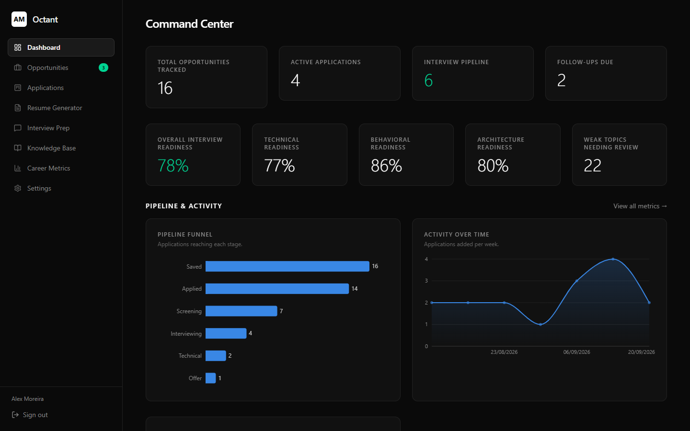
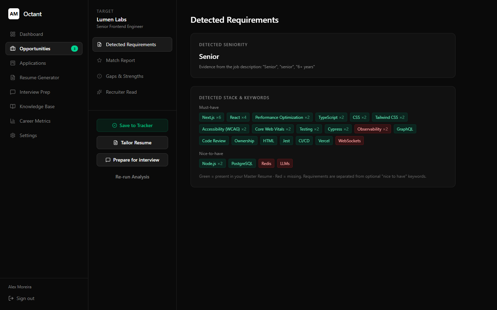
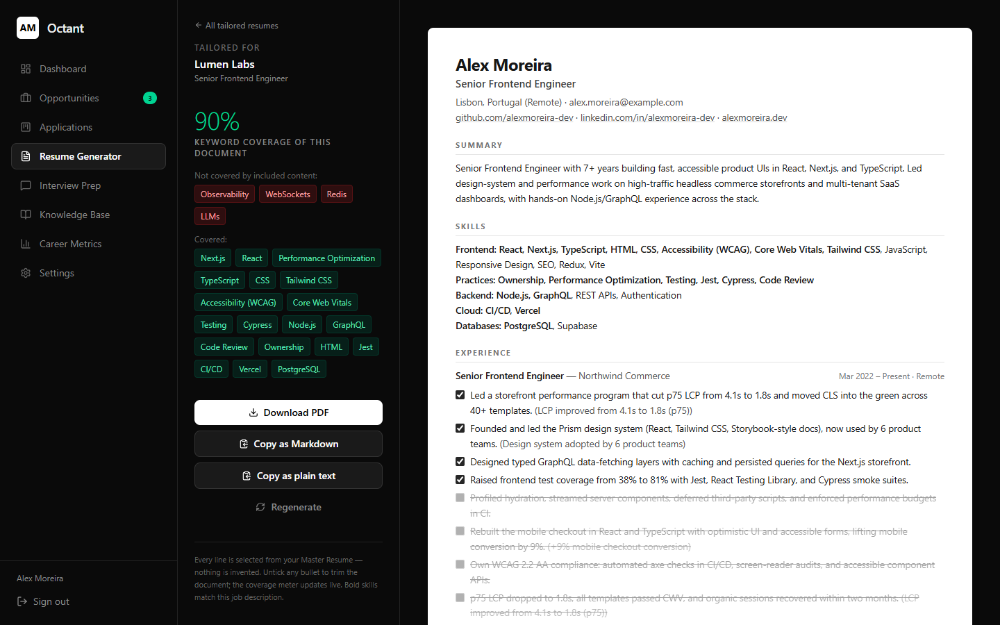
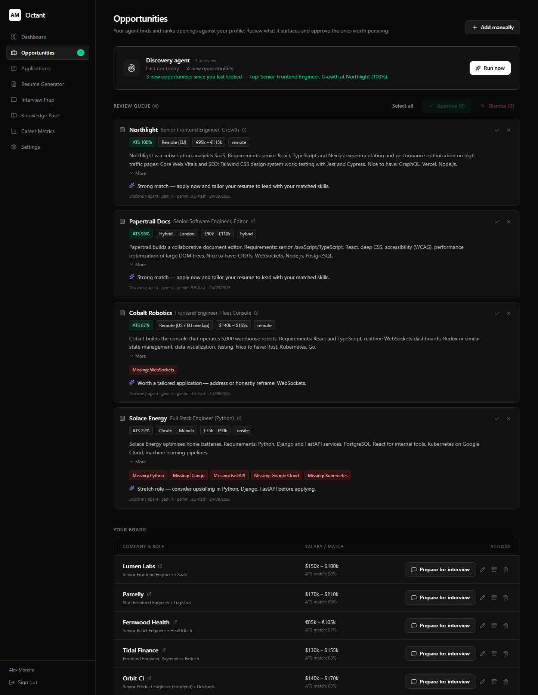
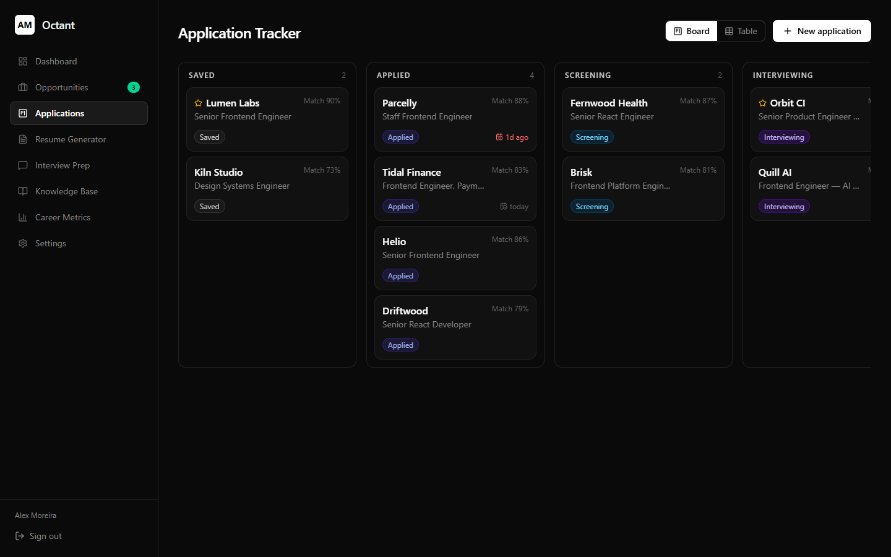
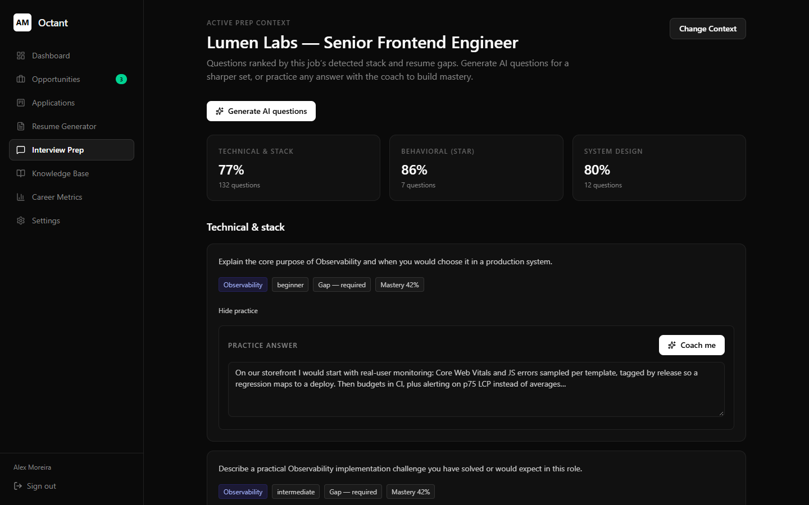
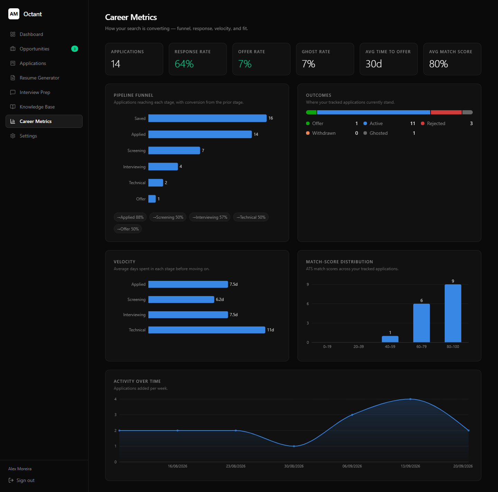
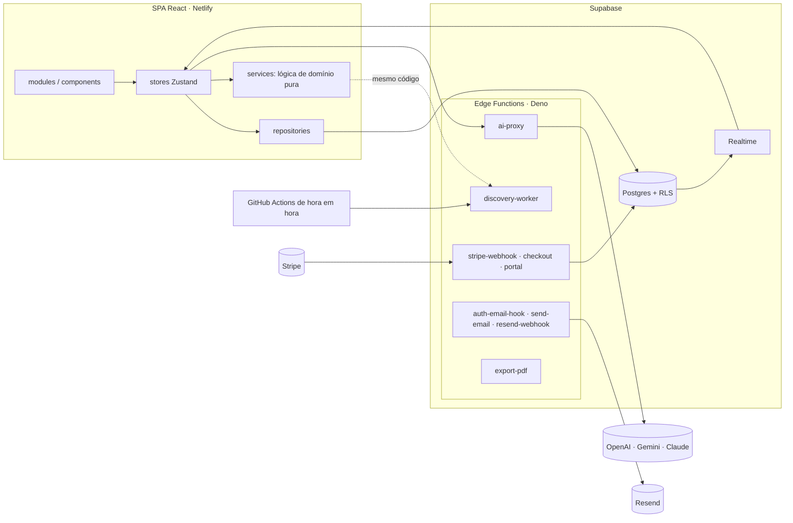

# Octant

**Português** · [English](README.en.md)

[](https://github.com/DeyvidJesus/octant/actions/workflows/ci.yml)

**Em produção:** [useoctant.com](https://useoctant.com/login)

**Um sistema para organizar a busca de emprego de desenvolvedores.** Você descreve sua carreira uma vez,
numa base de conhecimento estruturada, e o Octant deriva todo o resto dela: o quanto você combina com
cada vaga, um currículo adaptado para essa vaga, a preparação para a entrevista, o funil de candidaturas
e as métricas da sua busca. Um agente continua procurando vagas novas mesmo com você offline.

O princípio por trás de tudo: **o código decide o que é verdade, e a IA só cuida do texto.** Scores,
matches e o conteúdo do currículo são calculados a partir dos seus dados reais; a IA explica, sugere
perguntas ou corrige respostas, e o que ela gera é verificado por código antes de aparecer na tela.



---

## O que ele faz

| Área | O que você tem |
|---|---|
| **Base de conhecimento** | Perfil, experiências, projetos, skills, certificações, histórias e métricas como entidades tipadas. Importação de um currículo colado, com IA; tudo o que é importado entra como *a revisar*. |
| **Análise de vaga** | Cole a descrição de uma vaga → skills obrigatórias e desejáveis, senioridade, um score no estilo ATS, lacunas e pontos fortes. O "Recruiter Read" (IA) dá um veredito honesto e marca as afirmações que não têm base no seu currículo. |
| **Gerador de currículo** | Seleciona e ordena seus bullets e projetos reais para uma vaga. Ao desligar qualquer linha, um medidor mostra na hora o quanto de palavras-chave você perde. PDF gerado no servidor, seguro para ATS; export em Markdown e texto puro. |
| **Agente de busca** | Procura vagas abertas (busca na web com Google Search), remove duplicadas, calcula o score contra o seu currículo e coloca numa fila para você aprovar. Roda com o app aberto e de forma agendada, e aprende com o que você aprova ou dispensa. |
| **Candidaturas** | Kanban (arrastar e soltar, ou teclado) e uma tabela ordenável, com follow-ups, contatos e uma linha do tempo por candidatura. |
| **Preparação para entrevista** | Perguntas técnicas, comportamentais (STAR) e de system design a partir da stack da vaga e das suas lacunas. Um coach de IA corrige suas respostas, e o domínio de cada skill vai se acumulando. |
| **Métricas** | Funil e conversão, taxas de resposta, oferta e ghosting, tempo em cada etapa, atividade semanal e distribuição de score. |
| **Planos** | Free e Pro, com Stripe Checkout e Customer Portal. Os limites são garantidos pelo banco de dados, não só pela interface. |

<table>
  <tr>
    <td></td>
    <td></td>
  </tr>
  <tr>
    <td align="center"><sub>Análise de vaga: obrigatórias e desejáveis, presentes e ausentes</sub></td>
    <td align="center"><sub>Gerador de currículo: desligue um bullet e veja a cobertura mudar</sub></td>
  </tr>
  <tr>
    <td></td>
    <td></td>
  </tr>
  <tr>
    <td align="center"><sub>Agente de busca: nenhuma vaga entra no quadro sem aprovação</sub></td>
    <td align="center"><sub>Candidaturas (arrastar e soltar ou teclado)</sub></td>
  </tr>
  <tr>
    <td></td>
    <td></td>
  </tr>
  <tr>
    <td align="center"><sub>Preparação para entrevista e coach de IA</sub></td>
    <td align="center"><sub>Métricas da busca</sub></td>
  </tr>
</table>

<sub>As imagens usam uma pessoa fictícia de demonstração, com o app rodando localmente e o Supabase simulado.</sub>

## Como ele evita inventar coisas

- **O match é uma interseção de conjuntos.** Uma skill só conta como presente se estiver na vaga e no seu
  currículo, então nenhum analisador consegue inventar experiência. Score ATS = peso das skills presentes
  / peso total, com as obrigatórias valendo o dobro ([src/services/analysis](src/services/analysis)).
- **A proteção contra alucinação é código, não prompt.** O texto gerado passa pelo mesmo extrator de skills
  usado na análise; qualquer skill citada que não esteja no seu currículo nem na vaga é marcada (e, nas
  explicações escritas pelo agente, o texto é descartado) ([grounding.ts](src/services/ai/guardrails/grounding.ts)).
- **O gerador não escreve nenhuma palavra.** Ele só seleciona e ordena o conteúdo que já existe, e cada
  bullet guarda o id do fato de onde veio ([src/services/generator](src/services/generator)).
- **A IA transcreve, o código decide.** Importação de currículo, extração de vagas e geração de perguntas
  pedem ao modelo só JSON, que depois é validado e normalizado por código, com uma nova tentativa se vier
  quebrado.

---

## Arquitetura



**Camadas** (garantidas por regras de lint no [.oxlintrc.json](.oxlintrc.json)):
`modules/components → stores → repositories/services → types/utils/constants`. A interface nunca fala
direto com o Supabase nem com um repositório; `services/` e `repositories/` nunca importam React nem
stores. A lógica pura em `services/` roda tanto no navegador quanto no `discovery-worker`, em Deno.

Descrição completa: [docs/architecture.md](docs/architecture.md).

### Destaques de engenharia

**Frontend**
- **Interface otimista, guiada pelas stores.** As mudanças aparecem na hora; o `persist()` grava em segundo
  plano e, se falhar, mostra um aviso e sincroniza com o servidor (por exemplo, um item recusado pelo limite
  do plano some da tela).
- **Sincronização em tempo real entre dispositivos**, mesclada por id (o que também absorve o eco da própria
  escrita). O carregamento é feito por usuário, e todas as stores são limpas no logout ou na troca de conta.
- **Design system com tokens do Tailwind v4**: superfícies, cores de texto, inversão e estados
  (`success/danger/warning/info`). Os componentes base mesclam classes com `cn()` (tailwind-merge), e um
  teste quebra o build se uma cor crua aparecer no código de interface.
- **Code splitting**: as rotas pesadas carregam sob demanda, e os gráficos do Dashboard também, o que tira o
  Recharts (~110 KB gzip) do carregamento de todas as outras páginas, inclusive do login.
- **Acessibilidade**: mover cards do Kanban pelo teclado, modais que prendem o foco e o devolvem ao fechar,
  scores com `role="meter"`, botões de ícone com rótulo, diálogo de confirmação e avisos com `aria-live`.

**Backend**
- **RLS em todas as tabelas**; os limites do plano Free ficam em políticas `WITH CHECK` do RLS (regravar um
  item existente nunca é bloqueado).
- **Integridade do JSONB em duas camadas**: constraints `CHECK` em cada coluna JSONB (o id do documento
  bate com o da linha, os campos obrigatórios existem e o tamanho tem teto; criadas como `NOT VALID` para que
  dados antigos nunca travem um deploy) e schemas zod na leitura, que reparam o que tem um padrão seguro e
  descartam, com registro, o que não é confiável.
- **`ai-proxy`**: chaves dos provedores de IA só no servidor, lista fixa de endpoints (sem SSRF), teto de
  tamanho da resposta e orçamento mensal de tokens por plano.
- **Webhook do Stripe**: assinatura verificada; gravar o plano é o contrato (erro no banco → 500 para o
  Stripe reenviar), e só eventos mais novos que o último são aplicados, de forma atômica no SQL. Os emails
  de cobrança são melhor esforço, e a mudança de plano chega ao app em tempo real.
- **Emails sem duplicidade**: uma linha de reserva com `email_log.idempotency_key` único e a mesma chave
  enviada ao Resend; eventos de entrega fora de ordem não fazem o status voltar.
- **Um código, dois runtimes**: um passo com esbuild empacota a lógica compartilhada para o runtime Deno das
  Edge Functions ([scripts/bundle-functions.mjs](scripts/bundle-functions.mjs)); o CI falha se um bundle
  estiver desatualizado.

---

## Tecnologias

| | |
|---|---|
| **App** | React 19, TypeScript (strict), Vite, React Router 7, Zustand, Tailwind CSS v4, Recharts, lucide-react |
| **Backend** | Supabase: Postgres, Auth, Row Level Security, Realtime, Edge Functions (Deno) |
| **IA** | Adaptadores independentes de provedor (OpenAI, Gemini com Google Search, Claude, OpenRouter e modelos locais compatíveis com OpenAI) atrás de uma única interface `LLMProvider` |
| **Serviços** | Stripe (cobrança), Resend + React Email (14 templates transacionais), PostHog, Sentry |
| **Qualidade** | Vitest + Testing Library (happy-dom), PGlite para testes de banco, zod, oxlint, GitHub Actions |

## Estrutura do projeto

```
src/
├── app/           # Rotas (com lazy loading) e layout
├── contexts/      # Auth: sessão → carregamento dos dados → realtime
├── modules/       # Uma pasta por funcionalidade (páginas e componentes)
├── components/    # Componentes de interface sem regra de negócio, e layout
├── stores/        # Stores Zustand, persist() e orquestração entre stores
├── repositories/  # O único código que consulta as tabelas do Supabase
├── services/      # Lógica pura: análise, gerador, busca de vagas, entrevista, métricas, IA
├── constants/ types/ utils/
└── styles/        # Tokens de design
packages/email/    # Módulo de email, só de servidor (templates, renderização, envio via Resend, retry)
supabase/
├── functions/     # Edge Functions
├── migrations/    # Histórico do schema (0001 → 0018)
└── tests/         # Testes de banco no PGlite (schema, migrations, RLS, constraints)
```

## Como rodar

Requisitos: Node 22+, Yarn 1 e um projeto no Supabase.

```bash
yarn install
cp .env.example .env   # preencha VITE_SUPABASE_URL e VITE_SUPABASE_ANON_KEY
yarn dev
```

Banco de dados: no SQL Editor do Supabase, rode o `supabase-schema.sql` e depois, em ordem, todos os
arquivos de `supabase/migrations`. Edge Functions, segredos e o agendador da busca de vagas estão
explicados passo a passo em [docs/PRODUCTION.md](docs/PRODUCTION.md).

| Script | O que faz |
|---|---|
| `yarn dev` | Servidor de desenvolvimento (Vite) |
| `yarn test` | Vitest (≈510 testes, incluindo os de banco) |
| `yarn lint` | oxlint, incluindo as regras de camadas |
| `yarn build` | Checagem de tipos e build de produção |
| `yarn build:functions` | Regenera as Edge Functions empacotadas (rode depois de editar um `worker.ts`/`handler.ts`) |
| `yarn deploy:functions` | Regenera e publica todas as Edge Functions com a flag de JWT certa (Supabase CLI) |
| `yarn email:dev` | Pré-visualização dos templates de email |

## Testes

A maior parte do valor está em funções puras, então a maioria dos testes é de unidade e roda rápido: o
extrator de skills e o cálculo de match, a geração do currículo e a cobertura, as métricas, a busca de vagas
(dedupe, estratégias, aprendizado, cadência), os parsers das respostas de IA, a proteção contra alucinação e
o mapeamento e a renderização dos emails. Os testes de componente (happy-dom) cobrem o login, o Kanban
(teclado e arrastar e soltar), o focus trap, o diálogo de confirmação e os avisos. Os testes de banco rodam o
schema e todas as migrations no PGlite (Postgres compilado para WebAssembly) e verificam as constraints de
JSONB, o isolamento por RLS, os limites do plano e a ordem dos eventos do Stripe. O CI roda lint, testes,
build, `deno check` nas Edge Functions escritas à mão e a checagem dos bundles em todo push e pull request.

## Limitações conhecidas

- **Sem fila offline.** Uma escrita que falha é avisada e sincronizada de novo, não refeita.
- **A última escrita ganha** quando dois dispositivos editam a mesma coisa.
- **O orçamento de tokens de IA é checado antes de cada chamada**, não reservado de forma atômica; o teto
  por requisição limita o excesso.

Por que as coisas são assim: [docs/decisoes-tecnicas.md](docs/decisoes-tecnicas.md).

## Documentação

| Documento | Assunto |
|---|---|
| [docs/architecture.md](docs/architecture.md) | Camadas, fluxo de dados, design system, integridade do JSONB |
| [docs/database.md](docs/database.md) · [docs/supabase.md](docs/supabase.md) | Schema, RLS, realtime |
| [docs/ai.md](docs/ai.md) | Provedores, tarefas de IA e proteções |
| [docs/resume-engine.md](docs/resume-engine.md) · [docs/interview-engine.md](docs/interview-engine.md) | Gerador de currículo e preparação para entrevista |
| [docs/email.md](docs/email.md) | Arquitetura de email |
| [docs/PRODUCTION.md](docs/PRODUCTION.md) | Guia para colocar em produção |
| [docs/decisoes-tecnicas.md](docs/decisoes-tecnicas.md) | Decisões técnicas: contexto, decisão, trade-off e resultado |

Os documentos técnicos em `docs/` estão em inglês, exceto o índice (`README.md`), `decisoes-tecnicas.md`, `email.md` e `PRODUCTION.md`, que estão em português.
