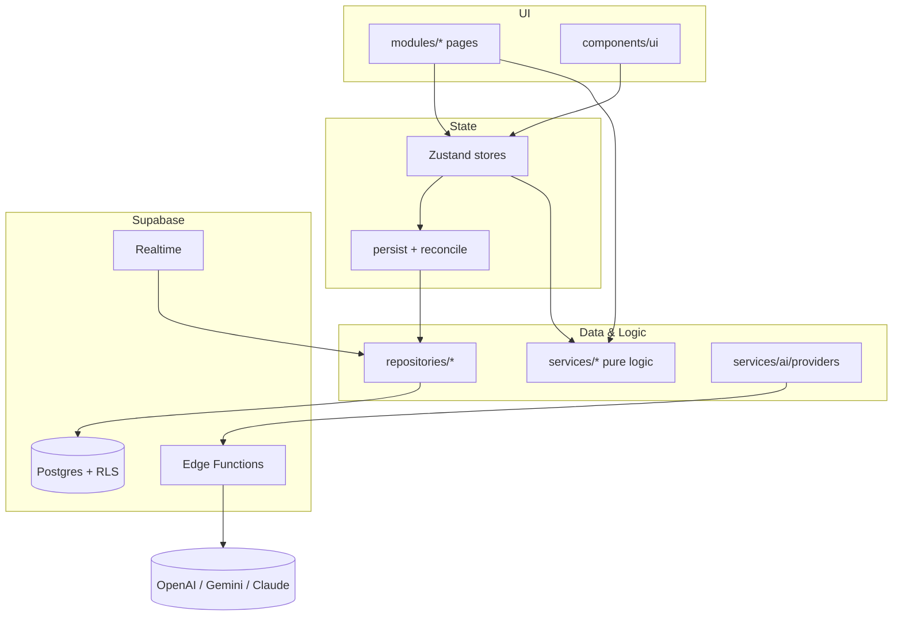
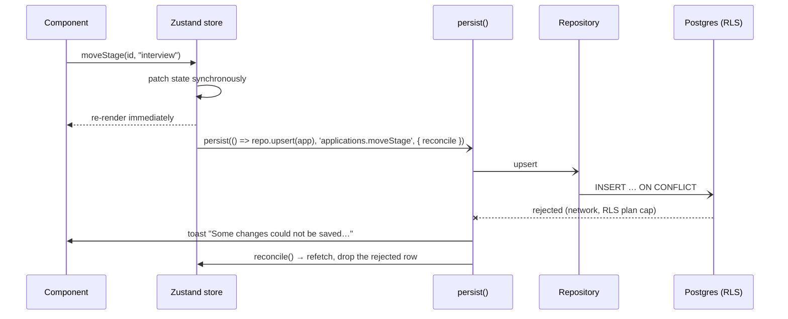

# Octant Architecture

## Overview

Octant is a React single-page app backed by Supabase (Postgres + Auth + RLS + Realtime + Edge
Functions). This document describes the architecture **as it is in the code today**: the layers, the
rules between them, how data moves, and where the known trade-offs are. For the history of how it got
here, see [DESIGN_REVIEW.md](DESIGN_REVIEW.md) and [technical-debt.md](technical-debt.md).

## Why this architecture exists

- **Optimistic, store-driven UI.** The app started local-first (IndexedDB via Dexie). When it moved to
  Supabase it kept that feel: Zustand stores are an in-memory replica of the user's data, mutations
  apply synchronously, and persistence happens out of band. There is no React Query layer, because
  the stores *are* the cache.
- **Deterministic code owns truth; the LLM owns language.** Scoring, matching, résumé tailoring and
  interview-prep plans are pure TypeScript. AI only transcribes, explains or grades, and its output is
  checked by code (`services/ai/guardrails/grounding.ts`).
- **The database is the security boundary.** Row Level Security scopes every table to `auth.uid()`,
  and free-plan caps are enforced in RLS policies (migration 0007). Secrets (AI vendors, Stripe,
  Resend, service role) live only in Edge Functions.

---

## Layers and dependency direction

```
src/
├── app/          # Router, lazy routes, layout shell
├── contexts/     # AuthProvider: session → hydration → realtime (useAuth hook in useAuth.ts)
├── modules/      # One folder per feature: pages + feature components
├── components/   # Domain-agnostic UI primitives (ui/) and layout
├── stores/       # Zustand stores + cross-store orchestration (persist.ts, discoveryRunner.ts)
├── repositories/ # The only code that talks to Supabase tables; returns domain types
├── services/     # Framework-free domain logic, AI providers/tasks, Supabase/auth plumbing
├── constants/ types/ utils/   # Leaf layers
└── styles/       # Tailwind v4 design tokens (@theme)
```

**Dependency flow:** `modules / components → stores → repositories / services → types, utils, constants`

These rules are **enforced by lint** (`no-restricted-imports` overrides in [.oxlintrc.json](../.oxlintrc.json)):

| Layer | May not import |
|---|---|
| `types/`, `utils/`, `constants/` | React, UI, stores, repositories |
| `services/`, `repositories/` | React, UI, stores |
| `stores/` | UI (`app`, `modules`, `components`, `contexts`) |
| `modules/`, `components/` | repositories, or the Supabase client directly |

Anything that needs to read several stores and call services (e.g. the in-session discovery run)
lives in `stores/`, so services stay pure and reusable. That purity is load-bearing: the same
`services/discovery/*` and prompt-building cores run in the browser **and** in the Deno
`discovery-worker` Edge Function.



---

## Data and state flow

### Hydration (`src/contexts/AuthContext.tsx`)
1. `getSession()` and `onAuthStateChange` both call `syncData(session)`.
2. The user id is mirrored into `services/supabase/session.ts`, so repositories resolve it
   synchronously (no `auth.getUser()` round-trip per write).
3. Hydration is keyed on **user id, not token**: a `TOKEN_REFRESHED` event does not refetch.
4. On every user transition (sign-in, sign-out, switch) realtime channels are torn down and
   `resetAllStores()` wipes memory, so nothing leaks across accounts on a shared browser.
5. All stores fetch in one `Promise.all`; realtime subscribes **after** the initial load, so deltas
   apply on top of hydrated state.

### Writes (optimistic)


### Realtime
`BaseRepository.subscribeToOwnedTable` listens to `postgres_changes` filtered by `user_id` for jobs,
applications and discovery. Stores merge by id (replace or prepend), which also absorbs the echo of
this device's own writes. Deletes carry `user_id` thanks to `REPLICA IDENTITY FULL` (migration 0004).

### Storage shape
Most tables are `{ id, user_id, data jsonb }` plus the few columns the database must act on
(`status`, `score`, `job_id`, `organization_id`, `mastery`). The knowledge base is split into
`resume_organizations / roles / skills / facts` so one edit is a one-row write
(`KnowledgeBaseRepository.applyChanges` diffs by id). See [database.md](database.md).

---

## Domain flows

- **Job analysis** — `services/analysis`: a taxonomy extractor tags each skill in the job description
  as required/preferred; ATS score = matched weight / total weight (required ×2). `matched` is a set
  intersection with the résumé, so no analyzer can invent experience.
- **Recruiter Read / coach / enrichment** — AI tasks receive only structured facts; the grounding
  guardrail flags (or drops) any skill the output names that is not in résumé ∪ job.
- **Résumé generator** — `services/generator`: selects and ranks real bullets by job-weighted relevance;
  every bullet keeps its source id; a coverage meter recomputes the ATS score from included content.
  PDF export runs server-side in the `export-pdf` Edge Function.
- **Discovery agent** — `services/discovery/pipeline.ts` (pure) runs strategies → grounded Gemini search
  → extraction → dedupe → deterministic scoring → streaming inserts. It runs in-session
  (`stores/discoveryRunner.ts`, cadence-gated) and offline (`discovery-worker`, triggered hourly by
  GitHub Actions; free users every 24 h, pro every 1 h). Nothing reaches the board without approval.
- **AI transport** — hosted providers call the `ai-proxy` Edge Function with the user's JWT; it holds
  the vendor keys, uses a fixed endpoint allowlist (no SSRF), clamps output size and enforces a
  monthly token budget per plan.
- **Billing & email** — Stripe Checkout/Portal/webhook write `subscriptions` with the service role;
  `packages/email` (React Email + Resend) sends auth, billing and account emails, idempotently via
  `email_log.idempotency_key`.

---

## Design system

Tailwind v4 CSS-first tokens in [src/styles/index.css](../src/styles/index.css):

- **Surfaces and ink:** `base`, `surface`, `surface-2`, `edge*`, `ink*`, `muted`, `faint`.
- **Emphasis and inversion:** `ink-strong`, `inverse`, `inverse-ink`, `scrim`, `paper`.
- **Status intents:** `success`, `danger`, `warning`, `info`, each with `-strong / -soft / -deep` steps.

Components use only these names; `src/styles/designTokens.test.ts` fails the suite if a raw palette
class (`text-red-400`, `bg-white`, …) appears in UI code. Primitives merge caller classes with
`cn()` (tailwind-merge), so `className` overrides win predictably. Two deliberate exceptions: the
printed résumé sheet (grayscale on paper) and the categorical stage/chart palettes, each defined in
one place.

---

## Known trade-offs (open)

- **No offline queue or rollback.** A failed write is surfaced and reconciled by refetch, not retried.
- **Last write wins.** Concurrent edits from two devices are not merged; realtime makes the window small.
- **JSONB rows are not schema-validated in the database** (`pg_jsonschema` is not enabled). RLS protects
  *who* writes, not *what* is written.
- **Knowledge-base relations** (fact → role/project) have no picker in the editor yet.
- **Tier changes are not pushed** to the client (no realtime on `subscriptions`); they apply on reload.
