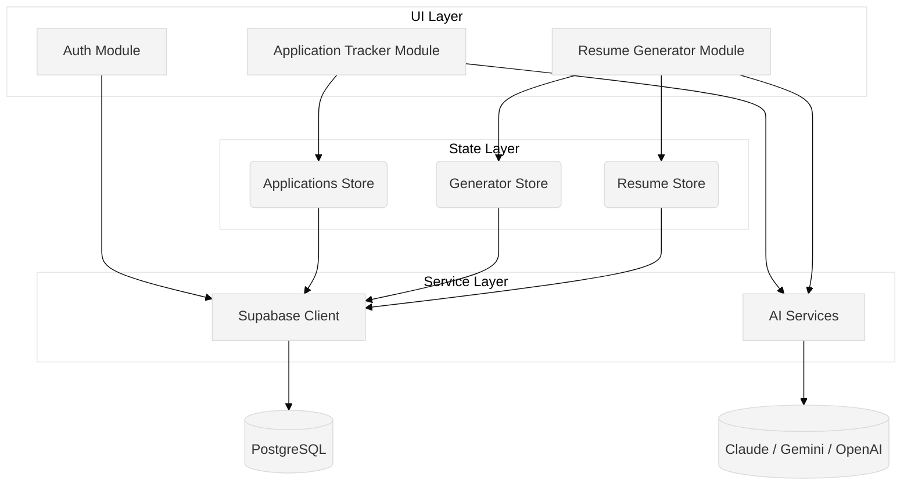
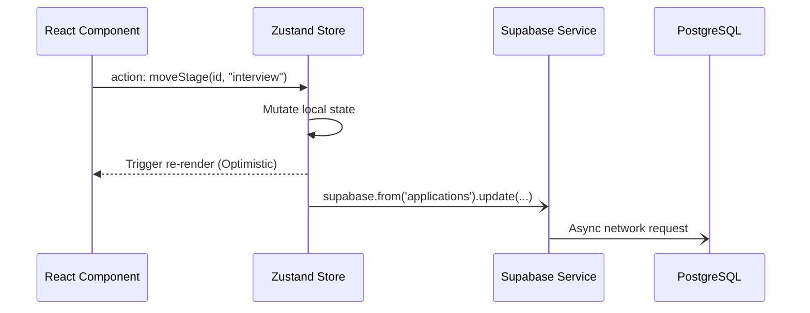

# Octant Architecture

## Overview

Welcome to Octant. This document serves as the technical blueprint of our platform, reverse-engineered directly from the codebase. It details how data flows, how boundaries are drawn, and highlights the technical debt present in the system today. 

## Why this architecture exists

Octant employs an **optimistic-UI, store-driven architecture** running on React and Supabase. 
Historically, the application utilized local-first `Dexie` persistence. It has recently migrated to a fully cloud-native Supabase PostgreSQL backend. However, it retains its "local-first" roots: instead of adopting traditional asynchronous data fetching layers (like React Query), the application uses Zustand stores as the singular source of truth for UI, aggressively updating local state before blindly flushing those changes to the Supabase backend asynchronously. 

The AI configuration is designed to be highly pluggable, extracting the specific vendor API mechanics into a service layer to easily swap between Anthropic, OpenAI, Google, and local models.

---

## Layer Separation

The application enforces a strict separation of concerns through its directory structure:

1. **`src/modules/` (Feature/UI Layer)**: Defines isolated page routes and feature-specific components. Each subdirectory represents a discrete business domain (e.g., `application-tracker`, `resume-generator`).
2. **`src/stores/` (State Layer)**: The heart of the application. Zustand stores (e.g., `resumeStore`, `applicationsStore`) act as localized in-memory databases. They provide the actions for the UI to call.
3. **`src/services/` (Service Layer)**: Interfaces with the outside world. This includes the Supabase client initialization, database sync logic, AI provider configurations (`ai/registry.ts`), and deep research orchestration.
4. **`src/components/` (Shared UI Layer)**: Dumb, reusable presentation components (buttons, inputs) and high-level wrappers (e.g., `ProtectedRoute`).

---

## Boundaries & Dependency Direction

### Feature Boundaries
Features are self-contained within `src/modules/*` and rarely import from one another. The primary feature boundaries are:
- `auth`: Login, Signup, and routing protection.
- `master-resume`: Core user profile and knowledge base editing.
- `resume-generator`: Job-specific resume tailoring.
- `application-tracker`: Pipeline of job applications.
- `job-discovery` / `job-opportunities`: Finding and cataloging job listings.
- `interview-prep`: Interview AI analysis.

### Module Boundaries & Dependency Direction
The dependency graph strictly flows downward. Modules are not allowed to directly mutate the database or manage API lifecycle states for core entities.

**Dependency Flow:**
`Modules (UI)` ➔ `Stores (Zustand)` ➔ `Services (Supabase/AI)` ➔ `External DB/APIs`

Modules import from Stores to read and write state. Stores import from Services to persist data.

---

## Data and State Flow

Octant treats Zustand stores as an in-memory replica of the database. 

1. **Read Flow**: Upon authentication, a store calls `_fetchFromSupabase()` to hydrate its initial state in memory. 
2. **Write Flow**: When a user acts, the UI calls a store action (e.g., `updateApplication`).
3. **Optimistic Update**: The store synchronously patches its internal state, triggering an immediate UI re-render.
4. **Persistence**: The store fires a "fire-and-forget" asynchronous `upsert` call to Supabase.

---

## Domain Flows

### Authentication Flow
1. User submits credentials via `LoginPage.tsx`.
2. Supabase auth service (`supabase.auth.signInWithPassword`) validates the user.
3. Once the session is established, `ProtectedRoute.tsx` mounts the `AppLayout`.
4. As the layout mounts, individual stores are responsible for calling their `_fetchFromSupabase()` methods to pull user-scoped data.

### AI Flow
AI logic is entirely abstracted behind `src/services/ai`. 
- **Standard Completions**: Providers (Claude, OpenAI, Gemini, Local) are cataloged in `registry.ts`. When a module requests a generation (e.g., interview analysis), the unified AI service wraps the prompt and talks to the selected provider.
- **Deep Research Flow**: Specific heavy tasks are routed uniquely. `deepResearch.ts` executes long-running asynchronous background jobs specifically using Google Gemini. It uses a polling mechanism (fast polling initially, dropping to slow polling) rather than a synchronous completion, persisting interaction IDs so users can navigate away and return.

### Resume Generation Flow
The generation engine is split between `resumeStore` and `generatorStore`:
1. **Master Data**: `resumeStore` holds the immutable `CareerKnowledgeBase`.
2. **Projection**: `resumeStore` automatically projects the KB into a `MasterResume`.
3. **Tailoring**: When generating a resume for a specific job, `generatorStore` clones the Master Resume into a `TailoredResume` mapped to a specific `jobId`.
4. **Curation**: The user toggles specific bullets or projects on/off via `toggleBullet` and `toggleProject`. These functions flip boolean `included` flags within the `TailoredResume` JSON tree.
5. **Persistence**: The tailored snapshot is saved to the `generators` table in Supabase.

---

## Architecture Critique & Technical Debt

Reviewing this codebase through the lens of a production-grade enterprise system reveals significant technical debt stemming from its prototype origins. 

### 1. Scalability Debt
* **Lack of robust sync mechanisms**: Store mutation functions blindly append `.then()` to Supabase updates (e.g., `supabase.from('applications').upsert(...).then()`). There is no global error handling, retry logic, or offline queueing. If a network request fails, the local state (which already updated optimistically) will permanently drift out of sync with the cloud until a hard refresh.
* **Redundant Auth Checks**: Every single write action in the stores (e.g., `toggleBullet`, `saveTailored`) executes `supabase.auth.getUser()` to fetch the user ID before writing. This creates massive redundant overhead per interaction instead of centrally managing the user context in the service layer.

### 2. Production Debt
* **Data Layer Coupling**: The application strictly violates separation of concerns by placing database querying logic (`supabase.from...`) directly inside Zustand store actions. Stores should manage UI state and delegate API communication to dedicated repository services.
* **Residual Migration Logic**: The codebase retains legacy artifacts from its Dexie past (e.g., `migrateV2ToV3` inside the live `updateResume` loop), penalizing runtime performance to handle outdated prototype structures.

### 3. Security Debt
* **Client-Dictated Payloads**: The frontend pushes entire JSON blobs to Supabase via generic `.upsert({ data: application })` calls. While Row Level Security (RLS) protects *who* can write the data, the schema relies entirely on client-side trust for the internal JSON structure, leaving it vulnerable to payload tampering.

### 4. Prototype Debt
* **Hydration Strategy**: There is no centralized data bootstrapper. Each store exports an isolated `_fetchFromSupabase` method. As the app scales, relying on individual components or stores to orchestrate their own hydration will lead to race conditions and waterfall loading issues.
