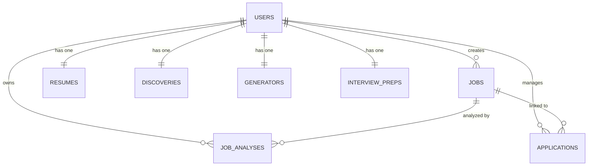
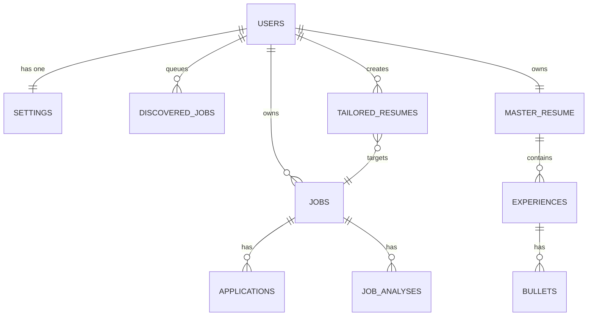

# CareerOS Database Architecture

This document outlines the current data model in Supabase, identifies technical debt stemming from the recent local-first migration, and proposes a production-ready relational schema.

---

## 1. Current Tables

The current architecture is a hybrid of relational tables and JSON document stores, directly reflecting its history as a local-first application (formerly using Dexie.js).

### Relational Tables
These tables utilize standard PostgreSQL columns and foreign keys.
* **`jobs`**: The core entity for saved opportunities.
* **`job_analyses`**: The ATS scoring output. Has a `CASCADE` delete relationship with `jobs`.
* **`applications`**: The active pipeline tracker. Has a `SET NULL` relationship with `jobs` (meaning if a job posting is deleted, the application history is retained).

### Key-Value (JSONB) Tables
These tables hold exactly **one row per user** (`user_id` is unique) and store massive JSON objects representing the entire Zustand store state.
* **`resumes`**: Holds the `knowledge_base` (the entire Master Resume graph).
* **`discoveries`**: Holds all pending, rejected, and approved scraped jobs.
* **`generators`**: Holds all generated tailored resumes.
* **`interview_preps`**: Holds interview progress and generated questions.
* **`settings`**: Holds user preferences.

---

## 2. Relationships & ER Diagram



---

## 3. Indexes & Performance

### Current State
Currently, Row Level Security (RLS) is enabled and ensures users can only access their own data via `auth.uid() = user_id`. 
However, there are **no secondary indexes** defined on `user_id`.

### Missing Indexes
Because every query in the system looks like `.eq('user_id', user.id)`, the lack of indexes causes a sequential scan across the entire table. As the user base grows, this will cause severe performance degradation.
**Required immediately:**
```sql
CREATE INDEX idx_jobs_user_id ON public.jobs(user_id);
CREATE INDEX idx_job_analyses_user_id ON public.job_analyses(user_id);
CREATE INDEX idx_applications_user_id ON public.applications(user_id);
```

---

## 4. Scalability & Technical Debt

The heavy reliance on JSONB columns for state synchronization introduces severe scalability limits.

### The "Over-write Clobbering" Problem
Because Zustand state is synced via fire-and-forget `.upsert()` calls, concurrent writes (e.g., the user edits a resume bullet in one tab, while a background AI task updates a job analysis in another) will clobber the entire JSON payload, leading to silent data loss.

### The Payload Size Problem (Discoveries Table)
The `discoveries` table stores arrays of rejected and approved jobs inside a single JSON blob. As a user scrapes hundreds of jobs, this blob will grow exponentially. 
* **Bandwidth**: Every time a user dismisses *one* job, the client must upload the *entire* list of thousands of jobs to Supabase.
* **Hard Limits**: PostgreSQL has a hard 1GB limit for a field, but performance degrades drastically much sooner when updating massive JSON objects.

---

## 5. Normalization Opportunities (Entity Evaluation)

For every entity, we must decide if it should remain a JSON blob or become fully relational.

### Should Remain JSONB
* **`settings`**: Preferences change frequently and lack deep relationships. A JSON blob is perfectly acceptable.
* **`applications.events`**: The timeline of application events (interviews, emails) is localized entirely to one application and doesn't need to be queried independently. Keeping it JSON avoids joining a heavily-trafficked events table.

### MUST Become Relational
* **`discoveries`**: **Critical priority**. Needs to become a standard `discovered_jobs` table: `(id, user_id, url, status: 'pending'|'rejected', data: jsonb)`. Dismissing a job should be an `UPDATE` on a single row, not a payload of the entire store.
* **`resumes`**: The Master Resume is deeply structured (Experience -> Projects -> Bullets). It should be split into `resume_experiences`, `resume_educations`, etc. This allows targeted updates and prevents data clobbering.
* **`generators`**: Tailored resumes should be stored as rows in a `tailored_resumes` table linked to a specific `job_id`. 
* **`interview_preps`**: Should be a `prep_sessions` table.

---

## 6. Ideal Schema for Production

To fix the JSON blob bottlenecks, the future production schema should look like this:



1. **Remove Singleton State Tables**: Delete `discoveries`, `generators`, and `interview_preps`.
2. **Implement Targeted Rows**: Replace them with lists of rows where `user_id` and an entity `id` define the primary key.
3. **Transition API Layer**: Zustand stores should no longer execute `upsert({ state: get() })`. They should call specific Repositories (e.g., `DiscoveryRepo.rejectJob(jobId)`), which fire targeted standard SQL updates.
