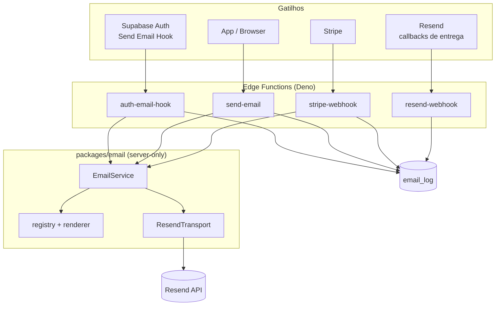

# Email (Fase 15)

Infraestrutura transacional de email do Octant: templates React Email, um único serviço tipado, e um só
arquivo que fala com o Resend.

Referência de implementação: [`packages/email/README.md`](../packages/email/README.md).

## Visão geral



## Por que essa divisão

**`packages/email` é um módulo interno, não um workspace.** Não tem `package.json` próprio — as
dependências ficam no manifesto raiz e `@octant/email` é só um alias de caminho (vitest, bundler esbuild
e `tsconfig` do módulo). O alias é **ausente** do `tsconfig.app.json` de propósito: o app não consegue
resolver `@octant/email` nem se alguém tentar importar, o que torna a fronteira abaixo mecânica.

**O browser nunca envia email.** `packages/email` é server-only: importa o SDK do Resend e
`react-dom/server`. Se `src/` o importasse, os dois entrariam no bundle do cliente e a API key ficaria a
um prefixo `VITE_` de distância de ser pública. O app pede pelo `send-email`; a função decide o quê e
para quem.

**Um só serviço.** Nada além de `transport/ResendTransport.ts` importa `resend`. Os 14 métodos de
`EmailService` desembocam num único `dispatch`, então renderização, idempotência, retry e log existem uma
vez só.

**Lógica pura fora das functions.** `supabase/functions/**` está fora do vitest, então o mapeamento de
payloads (Auth hook, eventos Stripe), o backoff e a formatação vivem em `packages/email` e são testados.
As functions guardam só o que precisa de runtime: verificação de assinatura, HTTP, escrita no banco.

## Os 14 templates

| Template | Gatilho hoje |
|---|---|
| `verify-email` | Auth hook — `signup` |
| `password-reset` | Auth hook — `recovery` |
| `magic-link` | Auth hook — `magiclink` |
| `invitation` | Auth hook — `invite` **(sem feature de convites no produto ainda)** |
| `email-changed` | Auth hook — `email_change` / `_new` (com link) e `_current` (aviso, sem link) |
| `security-alert` | Auth hook — `reauthentication`; e o intent `security-alert` |
| `welcome` | App, no primeiro login com email confirmado |
| `password-changed` | App, após `updatePassword` bem-sucedido |
| `subscription-created` | Stripe — `customer.subscription.created` |
| `subscription-cancelled` | Stripe — `customer.subscription.deleted` |
| `billing-success` | Stripe — `invoice.payment_succeeded` |
| `payment-failed` | Stripe — `invoice.payment_failed` |
| `trial-ending` | Stripe — `customer.subscription.trial_will_end` **(sem trial no produto ainda)** |
| `trial-expired` | Stripe — `.updated` saindo de `trialing` **(idem)** |

**Trial e Invitation não têm gatilho de produto.** O checkout não define `trial_period_days` e não existe
tabela de convites, então nada dispara esses três. Os templates, os métodos de `EmailService` e os ramos
do webhook estão implementados e testados — habilitar trials passa a ser uma mudança no checkout, não um
trabalho de template.

## Idempotência

O ponto mais importante do desenho. Cada envio tem uma chave determinística
(`template:userId-ou-destinatário:dedupeKey`) usada em **dois** lugares:

1. `email_log.idempotency_key` tem UNIQUE. `sendLogged` **insere a linha antes de enviar**, o que
   transforma a constraint num lock distribuído: duas entregas concorrentes do mesmo evento Stripe (ou um
   duplo clique) competem no insert, uma ganha e envia, a outra recebe conflito e retorna `deduped`.
   Registrar só depois do envio deixaria essa janela aberta.
2. O header `Idempotency-Key` do Resend, com o mesmo valor. Então mesmo um crash entre o claim e o envio
   não gera duas mensagens entregues.

É isso que torna o retry seguro. Sem chave, um timeout depois de a mensagem já ter sido enfileirada
entregaria duas cópias.

## Tratamento de erro

`EmailError` → `EmailConfigError`, `EmailValidationError`, `EmailRenderError`, `EmailTransportError`
(com `status`, `retryable`, `providerCode`), `EmailRateLimitError`, `EmailSuppressedError`. Mesmo formato
de `AppError` (código estável + `cause`).

`retryable` é decidido no adapter, onde o status do provedor ainda é visível — não re-derivado depois de
um `String(err)`. Retry: 3 tentativas, backoff exponencial com jitter, honrando `Retry-After`. Só
rede/408/429/5xx são retentados.

**Webhooks nunca respondem 5xx por falha de email.** O upsert de tier é o contrato; o email é
best-effort. Um 5xx faria o Stripe reprocessar um evento cujo trabalho de banco já deu certo. A falha vai
para `email_log`, não para a resposta HTTP. O `auth-email-hook` é a exceção deliberada: ali o usuário está
no meio de um signup ou reset e precisa saber que falhou.

## Sem API key

Toda a camada vira no-op: os templates ainda renderizam (então um template quebrado falha em dev também),
mas nada é enviado e nada estoura. Mesmo env-gating do `initSentry()` / `initAnalytics()`.

## Comandos

```bash
yarn email:dev        # preview dos 14 templates (React Email dev server)
yarn email:export     # renderiza tudo para .email-preview/*.html e *.txt
yarn email:probe      # POST assinado direto no auth-email-hook (ver abaixo)
yarn test             # inclui packages/email (252 testes)
yarn build:functions  # regenera os index.ts das 5 functions empacotadas
```

## Duas armadilhas do Send Email Hook

Ambas custaram tempo de debug real. Estão aqui para não custarem de novo.

**1. O hook roda dentro da transação não commitada do GoTrue.** Durante um signup, a linha nova em
`auth.users` só existe dentro daquela transação — e a Edge Function conecta em outra sessão, então **não a
vê**. Qualquer FK apontando para `auth.users` falha com `23503`, o hook devolve erro, e o GoTrue faz
rollback do signup inteiro. O sintoma é traiçoeiro: todo signup dá 500, `auth.users` fica vazia, e
`email_log` não tem linha nenhuma explicando. Probes sem `user_id` funcionam, então o pipeline parece
saudável.

Por isso a migration [0015](../supabase/migrations/0015_email_log_drop_user_fk.sql) remove a FK de
`email_log.user_id`. O `sendLogged` também tem fallback: em `23503`, regrava sem a associação — perder o
vínculo com o usuário é muito melhor que bloquear cadastros.

**2. Erro de negócio tem que voltar com HTTP 200.** Responder com o status da falha (500, 422…) faz o
GoTrue **descartar o corpo** e reportar só `"Unexpected status code returned from hook: 500"` — sua
mensagem morre ali. O transporte funcionou; foi o resultado que falhou. Então: status 200, e o
`error.http_code` no corpo carrega a intenção. Só assim a mensagem chega ao log e ao cliente.

Assinatura inválida é a exceção — aí o status HTTP real (401) é correto, porque não é uma chamada válida do
GoTrue.

## Debugando o auth-email-hook

**Não debugue pelo signup.** O GoTrue tem um rate limit de emails por projeto e ele dispara em
`/auth/v1/signup` **antes** de chamar o hook — `over_email_send_rate_limit`, HTTP 429. O default é baixo
(2/hora no SMTP embutido), então três ou quatro tentativas esgotam a cota e você fica sem conseguir testar.
Pior: cada tentativa falha deixa um usuário criado e não confirmado, e o próximo signup passa a dizer
"já registrado".

Use o probe, que fala direto com a função — assinando o payload do mesmo jeito que o GoTrue, então a
verificação de assinatura é exercitada de verdade:

```bash
SEND_EMAIL_HOOK_SECRET='v1,whsec_...' SUPABASE_URL='https://<ref>.supabase.co' \
  yarn email:probe signup você@seudominio.com
```

Ele imprime o status e o corpo. Desde a correção do handler, **a causa vem na mensagem** — chave
service-role ausente, `EMAIL_FROM` inválido, rejeição do Resend — em vez do antigo 500 opaco.

Onde ajustar o limite: Dashboard › Authentication › Rate Limits › "Rate limit for sending emails".

## Deliverability

`useoctant.com` precisa de SPF, DKIM e DMARC verificados no Resend antes de qualquer envio real — sem
isso o provedor rejeita o `EMAIL_FROM`. O `resend-webhook` alimenta a lista de supressão do Resend em
hard bounce e reclamação de spam; continuar mandando para um endereço que deu hard bounce é exatamente o
que destrói a reputação do domínio, e reputação ruim afeta o reset de senha de **todos** os usuários, não
só daquele. Soft bounce (caixa cheia, erro temporário) não suprime.

Passos manuais de painel: ver a seção final do checklist de setup.
