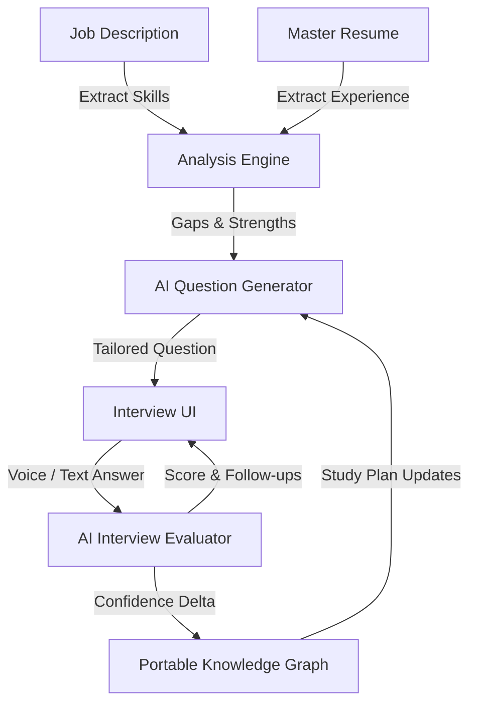

# CareerOS Interview Engine

This document outlines the architecture of the Interview Prep module, analyzing its current deterministic implementation and proposing an ideal architecture for evolving CareerOS into a fully-fledged "Interview Operating System."

---

## 1. Current Implementation

The current interview engine (`src/services/interviewPrep/`) is designed as a strict, deterministic study planner rather than a dynamic mock-interview simulator.

### Study Plans & Priority Ranking
Study plans are generated deterministically via `generatePrep.ts`. When a user targets a job, the engine cross-references the `JobAnalysis` with the `CareerKnowledgeBase` and ranks technologies into strict priority buckets:
1. `required-missing` (Critical Weaknesses)
2. `required-matched` (Core Validation)
3. `preferred` (Bonus Points)
4. `resume-core` (Safety Net)

### Question Generation
There is **no AI** involved in generating questions. The system relies entirely on hardcoded, statically defined question banks (`behavioralBank.ts` and `questionBank.ts`).
For technical topics, the system maps the required technologies (e.g., "React") to generic difficulty tiers (`beginner`, `intermediate`, `advanced`).

### The Learning Model (Evaluation & Tracking)
* **Self-Evaluation**: Evaluation is currently entirely manual. Users self-rate their confidence on a scale of `0-100` and mark questions as `mastered`.
* **Portable Mastery**: Progress is keyed by a deterministic question ID in `progress.ts`. This is a critical architectural choice: if a user masters an "Advanced React" question while applying to Job A, that mastery perfectly carries over when they apply to Job B. Progress is tied to the *skill*, not the *application*.
* **State**: Tracked in `interviewPrepStore` via pure reducers and synced to Supabase as a JSON blob.

---

## 2. Missing Implementation

While the deterministic foundation is solid for a study checklist, it falls short of interview readiness:
* **Dynamic Technical Questions**: A senior engineering interview doesn't ask generic "What is React?" questions; it asks about specific tradeoffs. The hardcoded banks cannot simulate this.
* **Real-time Feedback**: The AI Interview Coach (`src/services/ai/tasks/interviewCoach.ts`) exists, but it operates as a disconnected utility. It is not integrated into a continuous feedback loop that updates the user's `confidence` score in the study plan.
* **Audio/Speech Parsing**: Currently, users must type their answers.
* **Weakness Generation**: The system flags missing skills but doesn't actually teach the user how to bridge the gap.

---

## 3. Future Architecture: The Interview Operating System

To evolve from a static resume builder into an **Interview Operating System**, CareerOS must shift from "Study Planning" to "Active Simulation."

### The Ideal Implementation

### 1. Dynamic AI Question Generation
Remove the hardcoded `questionBank.ts`. Instead, use an Edge Function to generate highly targeted questions.
* If the user claims 5 years of AWS experience but the job requires strictly *Serverless* AWS, the AI should generate a question specifically testing Serverless constraints based on their previous generic AWS projects.

### 2. Closed-Loop Evaluation
Integrate the `interviewCoach.ts` directly into the learning model.
* Instead of the user self-rating their confidence (`0-100`), the AI evaluates their recorded answer. 
* If the AI scores the answer highly, the `interview_preps` state automatically increments the mastery confidence for that specific technology node.
* If the AI detects a gap, it automatically schedules a "Hard Follow-up" question for the next session.

### 3. Weakness Tracking & Study Plans
Currently, `required-missing` skills just sit as empty questions. The ideal architecture would:
1. Detect a missing skill.
2. Ask the LLM to map the missing skill to the user's known adjacent skills (e.g., mapping a missing "Vue.js" requirement to their known "React" experience).
3. Generate a study plan specifically teaching them how to pivot their existing knowledge into the required vocabulary.

### 4. Relational Data Structure
The `interview_preps` JSON blob must be dissolved. Progress must be tracked in normalized PostgreSQL tables:
* `user_skills` (tracks overall mastery of a technology)
* `mock_interviews` (records a session)
* `mock_answers` (stores the prompt, the user's audio/text, and the AI's grading rubric).

This allows CareerOS to provide analytics: *"You are consistently failing system design questions related to caching."*
