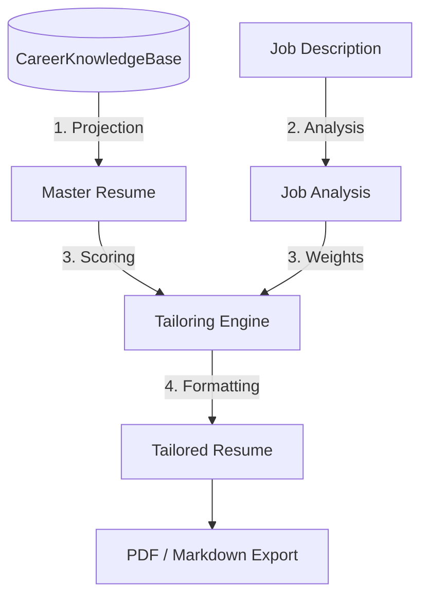

# CareerOS Resume Engine

The core value proposition of CareerOS is the ability to maintain a single source of truth and instantly project tailored resumes for different jobs. This document outlines exactly how the "Resume Engine" achieves this, differentiating deterministic ranking from AI abstraction.

---

## 1. The Workflow & Data Flow

The Resume Engine is structured as a pipeline of functional transformations. Data flows sequentially through three distinct models:

### Phase 1: The Knowledge Base (Persisted Truth)
Instead of a text document, the user's career is stored as a graph (`CareerKnowledgeBase`). Facts (responsibilities, results, challenges) are stored independently and linked by UUID to organizations, roles, and skills. 
* **State**: Contains unreviewed facts, pending migrations, and confirmed data.

### Phase 2: Master Resume Projection (`projection.ts`)
The projection layer acts as a strict firewall. It flattens the complex `CareerKnowledgeBase` graph into a standard `MasterResume` shape.
* **Filter**: It automatically strips out any facts that are marked as `pending` or `needs_review`.
* **Output**: A deterministic, read-only view guaranteeing that only verified truths reach the generation engine.

### Phase 3: The Tailoring Engine (`generate.ts` & `score.ts`)
When a user applies to a specific job, the engine dynamically assembles a one-page resume. 
* **ATS Weighting**: It reads the `JobAnalysis` and assigns numeric weights to skills (e.g., Required skills = 2x multiplier).
* **Scoring**: Every bullet (`Accomplishment`) and project in the Master Resume is scanned for skill keywords and scored mathematically against the job weights.
* **Reordering & Trimming**: Bullets are sorted descending by score. The engine dynamically crops the resume to fit ATS standards (e.g., maximum 4 bullets per experience, minimum 2 even for unrelated roles).

---

## 2. AI vs. Deterministic Responsibilities

A massive architectural decision in CareerOS is **excluding AI from resume generation**.

### Deterministic Responsibilities (The Generator)
The tailoring engine (`src/services/generator/generate.ts`) is 100% pure TypeScript.
* It **selects** existing bullets.
* It **reorders** existing bullets.
* It **deletes** irrelevant bullets.
* It **never hallucinates**. If a bullet is in the Tailored Resume, it is a mathematical certainty that the user wrote it and confirmed it in the Knowledge Base.

### AI Responsibilities
AI is strictly relegated to the *analysis* and *feedback* layers, never the *generation* layer.
* **Job Analysis**: AI explains *why* the deterministic engine scored a resume a certain way (`explainMatch.ts`), acting as a "Recruiter Read".
* **Interview Coaching**: AI critiques how the user speaks about their facts.

---

## 3. Current Limitations

1. **Client-Side Processing**: The entire `MasterResume` projection and `TailoredResume` scoring happens in the browser via Zustand. While fast, it blocks the main thread for massive career graphs and exposes all logic to the client.
2. **Brittleness in Export**: Markdown generation works well, but generating highly specific, pixel-perfect ATS PDFs currently relies on the browser's print engine (which varies wildly between Chrome, Safari, and Firefox).
3. **Rigid ATS Heuristics**: The `score.ts` engine uses strict string-matching for its weights. A resume bullet mentioning "React.js" might miss scoring points if the job description specifically asked for "React".

---

## 4. Ideal Resume Engine Architecture (Future State)

To scale into a production-ready enterprise SaaS, the engine must evolve:

### 1. Relational Knowledge Graph
The `CareerKnowledgeBase` should stop being a massive JSONB blob in Supabase (see `database.md`). It must become normalized relational tables (`facts`, `skills`, `organizations`).

### 2. Edge Function Projection
The `MasterResume` projection should happen via a Supabase PostgreSQL View or an Edge Function. The client should request `GET /api/resume/master`, keeping heavy graph traversal off the user's device.

### 3. Serverless PDF Generation (Puppeteer/Playwright)
Instead of rendering HTML on the client and relying on `window.print()`, the architecture must implement a dedicated export service. 
* The UI sends the `TailoredResume` JSON to an Edge Function.
* The Edge Function runs headless Chromium, injects a standardized CSS template guaranteed to parse perfectly in modern ATS systems (Workday, Greenhouse), and returns a binary PDF buffer.
* This guarantees the exact same PDF output regardless of what browser or operating system the user is on.

### 4. Semantic ATS Scoring
Upgrade `score.ts` to utilize vector embeddings alongside strict keyword matching. This allows the system to recognize that a bullet describing "AWS Lambda" semantically satisfies a job requirement for "Serverless Computing," boosting its relevance score organically.
