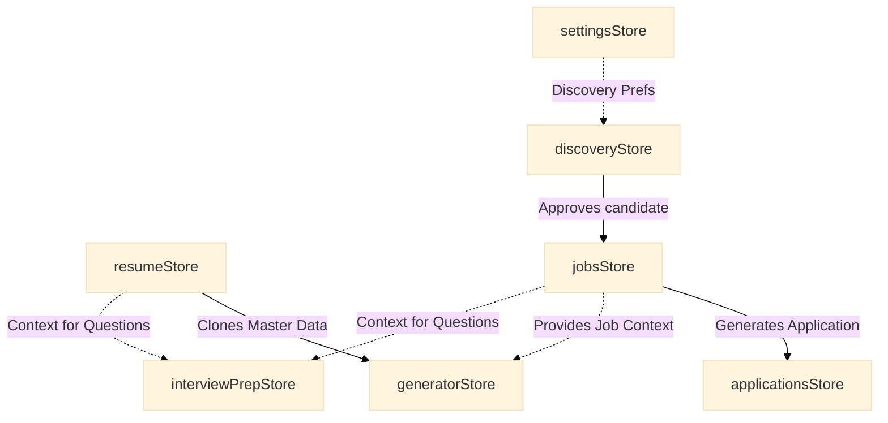

# Zustand Stores Architecture

Octant relies heavily on [Zustand](https://github.com/pmndrs/zustand) for global state management. The stores act as an in-memory representation of the database, providing instantaneous UI updates while asynchronously persisting to Supabase.

Below is an exhaustive breakdown of every store in the application.

---

## 1. `applicationsStore.ts`
* **Purpose**: Manages the Kanban pipeline of job applications.
* **Responsibilities**: Handles CRUD for applications, moving stages (e.g., "applied" to "interviewing"), and recording timeline events (notes, contacts).
* **State**: `applications` (Array).
* **Actions**: `upsertApplication`, `updateApplication`, `removeApplication`, `moveStage`, `addEvent`.
* **Persistence**: Saved to the `applications` table.
* **Dependencies**: `services/applications/events.ts` (pure functions for timeline events), Supabase Client.
* **Consumers**: Application Tracker module, Metrics dashboard.
* **Synchronization**: Hydrates via `_fetchFromSupabase` on load.
* **Problems**: Blind `.upsert` updates after local state changes; no rollback if the network fails.
* **Future improvements**: Abstract persistence to a middleware, implement an offline sync queue.

## 2. `discoveryStore.ts`
* **Purpose**: Orchestrates the intake queue for new job opportunities.
* **Responsibilities**: Deduplicates incoming jobs, tracks dismissed job keys (to prevent re-surfacing), and manages the async state of Deep Research runs.
* **State**: `candidates`, `dismissedKeys`, `lastSweepAt`, `pendingInteractionId`.
* **Actions**: `addCandidates`, `removeCandidates`, `dismissCandidates`, `markSweepRan`, `setPendingInteraction`.
* **Persistence**: Saved to the `discoveries` table as a unified JSON state.
* **Dependencies**: `services/discovery/dedupe.ts`.
* **Consumers**: Job Discovery module.
* **Synchronization**: Hydrates via `_fetchFromSupabase`.
* **Problems**: The `dismissedKeys` array continuously grows (capped at 500). Storing this as a single JSON blob alongside candidates is inefficient.
* **Future improvements**: Move dismissed keys to a dedicated relational database table.

## 3. `generatorStore.ts`
* **Purpose**: Manages job-specific tailored resumes.
* **Responsibilities**: Caches snapshots of Master Resumes cloned for specific jobs, allowing users to toggle the inclusion of specific bullets and projects for tailoring.
* **State**: `tailored` (Record map of `jobId` -> `TailoredResume`).
* **Actions**: `saveTailored`, `removeTailored`, `toggleBullet`, `toggleProject`.
* **Persistence**: Saved to the `generators` table.
* **Dependencies**: Supabase Client.
* **Consumers**: Resume Generator module.
* **Synchronization**: Hydrates via `_fetchFromSupabase`.
* **Problems**: Cloning the entire Master Resume per job balloons storage heavily. 
* **Future improvements**: Store a relational map of exclusions (`job_id` -> excluded `bullet_ids`) instead of copying the whole document.

## 4. `interviewPrepStore.ts`
* **Purpose**: Tracks user readiness and mastery for interview questions.
* **Responsibilities**: Records self-rated confidence scores, status tracking, mastery toggles, and user notes per question.
* **State**: `tracked` (A `ProgressMap` keyed by deterministic question IDs).
* **Actions**: `rate`, `setStatus`, `toggleMastered`, `setNotes`, `remove`.
* **Persistence**: Saved to the `interview_preps` table.
* **Dependencies**: Pure reducers in `services/interviewPrep/progress.ts`.
* **Consumers**: Interview Prep module, Metrics.
* **Synchronization**: Hydrates via `_fetchFromSupabase`.
* **Problems**: Direct inline `.then()` database syncs tightly couple UI state with network.
* **Future improvements**: Decouple side-effects from the store into a dedicated repository layer.

## 5. `jobsStore.ts`
* **Purpose**: Catalog of saved, active job descriptions and their analyses.
* **Responsibilities**: Stores job postings approved from Discovery, and caches the deterministic gap analysis (ATS match score) for each.
* **State**: `jobs` (Array), `analyses` (Record map).
* **Actions**: `addJob`, `addJobs`, `updateJob`, `removeJob`, `saveAnalysis`.
* **Persistence**: Saved to `jobs` and `job_analyses` tables.
* **Dependencies**: Supabase Client, Seed Data.
* **Consumers**: Job Board module, Generator module (for job context).
* **Synchronization**: Fetches both jobs and analyses concurrently in `_fetchFromSupabase`.
* **Problems**: Bulk additions (`addJobs`) can fail partially; no transaction boundary exists for the Supabase call.
* **Future improvements**: Utilize PostgreSQL RPCs for safer bulk mutations.

## 6. `resumeStore.ts`
* **Purpose**: The absolute source of truth for the user's career history.
* **Responsibilities**: Manages the rich `KnowledgeBase` and dynamically projects it into the flatter `MasterResume` for consumption. Maintains legacy data migrations.
* **State**: `knowledgeBase` (source of truth), `resume` (projected view).
* **Actions**: `updateKnowledgeBase`, `patchKnowledgeBase`, `updateResume` (deprecated bridge).
* **Persistence**: Saved to the `resumes` table.
* **Dependencies**: `services/resume/projection.ts`, legacy migration scripts.
* **Consumers**: Master Resume module, Generator module.
* **Synchronization**: Hydrates via `_fetchFromSupabase`.
* **Problems**: Legacy prototype code (`migrateV2ToV3`) executes inside the action loop, hindering performance. The JSON structure is massive for a single row.
* **Future improvements**: Break the JSON object down into normalized SQL tables (e.g., `companies`, `projects`, `skills`).

## 7. `settingsStore.ts`
* **Purpose**: Application preferences and app-level state.
* **Responsibilities**: Tracks whether the user has completed onboarding and their job discovery preferences.
* **State**: `discovery`, `onboardingCompleted`.
* **Actions**: `setDiscoveryPrefs`, `completeOnboarding`.
* **Persistence**: Saved to the `settings` table.
* **Dependencies**: Supabase Client.
* **Consumers**: AppLayout (Onboarding modal), Settings module.
* **Synchronization**: Hydrates via `_fetchFromSupabase`.
* **Problems**: AI configuration was removed from settings state and hardcoded to `.env` variables via `resolveAiRunConfig`, fragmenting configurations.
* **Future improvements**: Re-integrate dynamic AI configurations into the database settings store.

---

## Store Interaction Graph

While stores are technically independent slices, they relate to each other semantically through IDs. The data follows a logical pipeline:

---

## Global vs. Local State Recommendations

Not all state needs to live globally in Zustand. 

### Keep as Global State
* **`resumeStore`**: The Master Resume is cross-cutting. The Generator, Interview Prep, and Metrics modules all require instant access to the user's base skills.
* **`jobsStore`**: Saved jobs are referenced across Applications, Generators, and Interviews.
* **`applicationsStore`**: Application metrics appear in dashboards and require global accessibility.
* **`settingsStore`**: Used for global app shell conditionals (like the onboarding modal).

### Refactor to Local State
* **`discoveryStore`**: 
  * *Reasoning*: The discovery queue is an ephemeral intake pipeline. Once a candidate is approved, it moves to the `jobsStore`. There is no reason for `discoveryStore` to be global, as it is only ever used inside the `/jobs/discovery` route. It should be refactored into a local `useReducer` or React Query hook tied exclusively to the `JobDiscoveryPage`.
* **`generatorStore`**:
  * *Reasoning*: Tailored resumes are massive objects and are only actively curated while the user is inside the `/generator/:jobId` route. By keeping this global, the app holds heavy payload maps in memory unnecessarily. This should be refactored into a route-level localized state, fetching from Supabase only when navigating to the specific editor, and clearing from memory on unmount.
